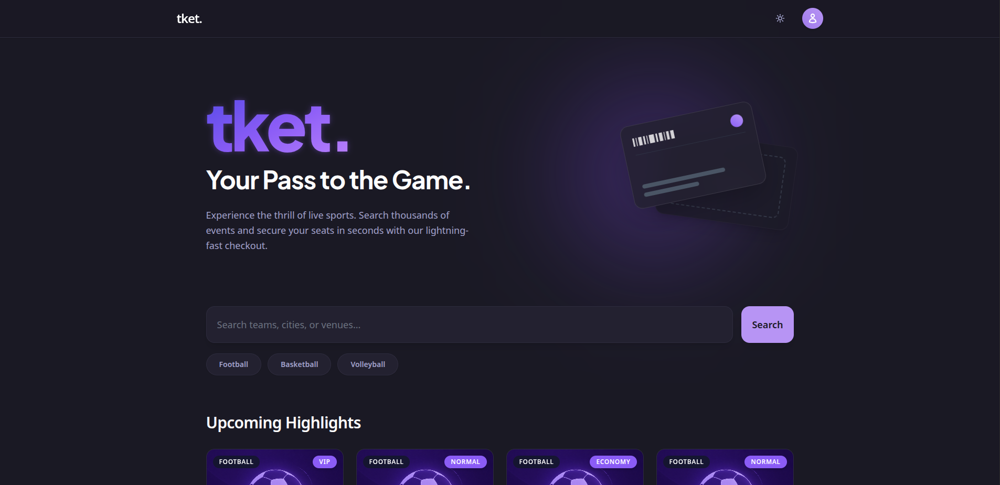
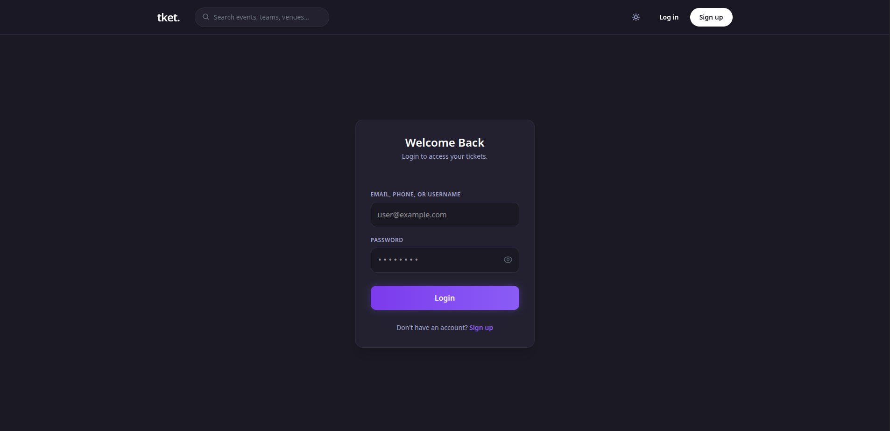
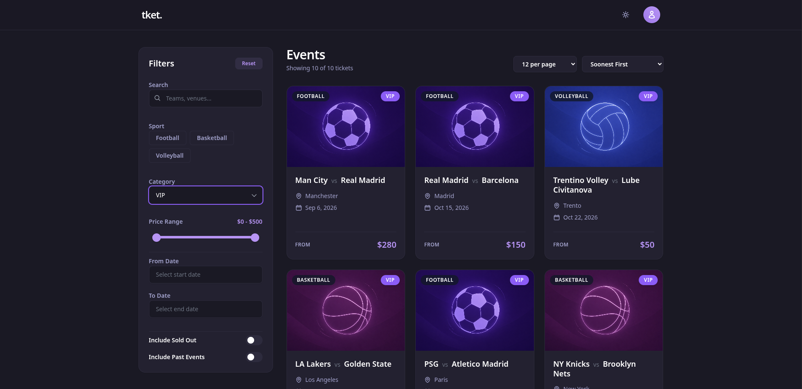
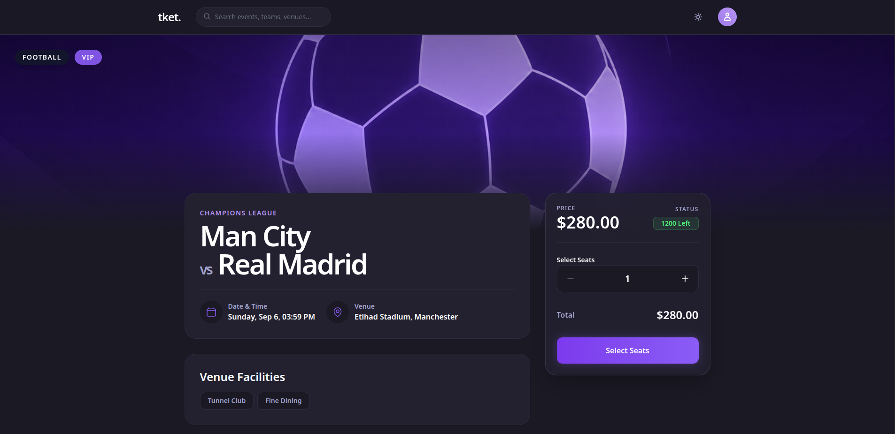
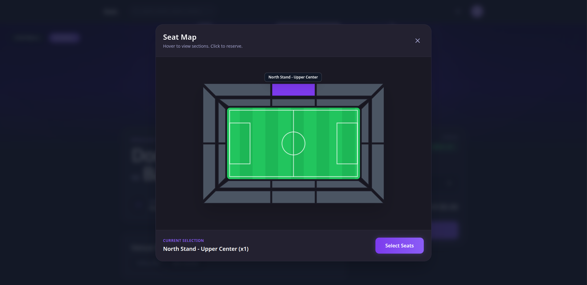
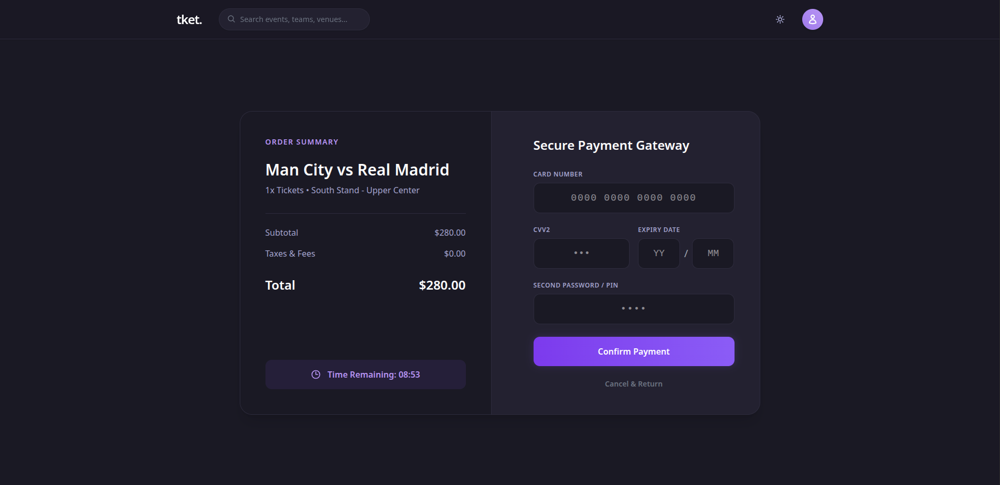
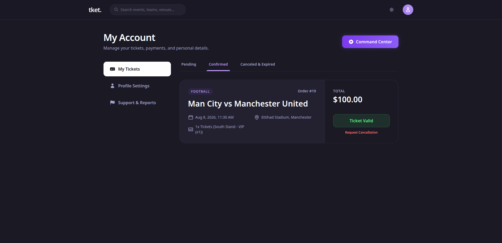
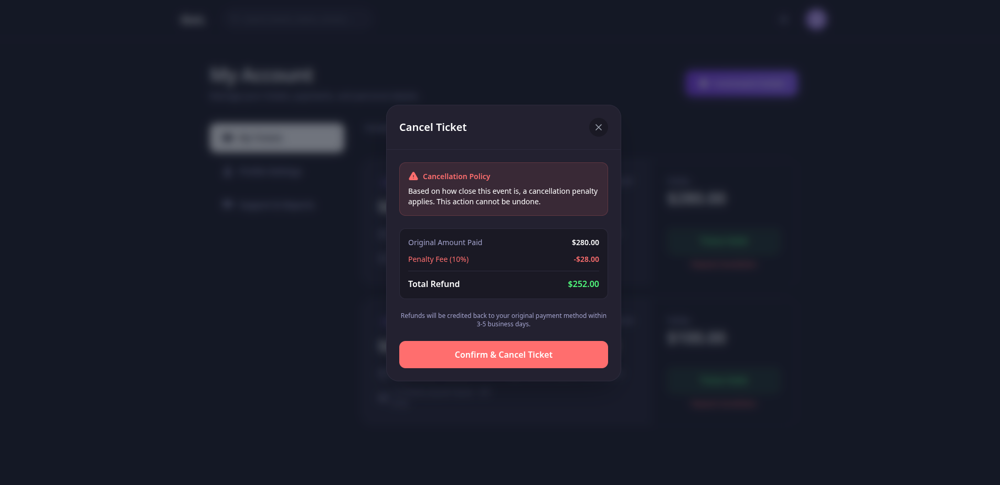
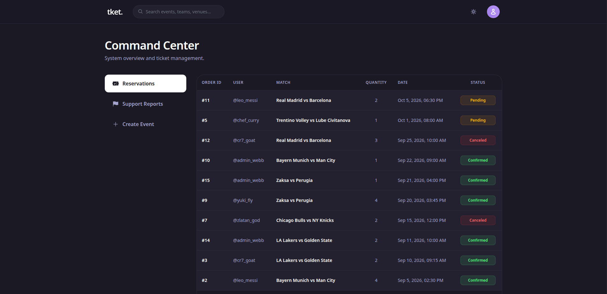

# 🎟️ tket - Sports Ticketing Platform


**tket** is a full-stack sports ticketing platform built around a Django REST API, PostgreSQL database, Redis caching layer, and React frontend.

The project was developed as a comprehensive final project for **Database Systems Design**, with a deliberate architectural constraint: the backend completely avoids Object-Relational Mappers (ORMs). Database operations are handled through raw PostgreSQL queries, stored procedures, and triggers, giving the system direct control over database behavior and business logic.

---

## 📑 Table of Contents

* [Platform Preview](#-platform-preview)
* [Engineering Highlights](#-engineering-highlights)
* [Development Overview](#-development-overview)
* [API Documentation](#-api-documentation)
* [Setup & Installation](#️-setup--installation)
* [Repository Structure](#-repository-structure)

---

## 📸 Platform Previews



<details>
  <summary><b>✨ Click to explore the Full Platform UI</b></summary>
  <br>

  
  *Secure Login/Signup flow with OTP verification.*

  
  *Real-time ticket filtering and dynamic search.*

  
  *Ticket detail page fetching live stadium capacities.*

  
  *Select seats with interactive seat map.*

  
  *Secure checkout with active concurrency locks.*

  
  *User profile and reservation management.*

  
  *Dynamic cancellation penalty calculations via interactive modals.*

  
  *The secure admin command center for ticket management and support.*

</details>

---

## 🚀 Engineering Highlights

* **Raw SQL Data Layer:** All database interactions bypass the Django ORM through parameterized `cursor.execute()` calls, providing direct control over query execution while preventing SQL injection.
* **Concurrency-Safe Booking:** Ticket reservations use row-level database locking and atomic transactions to prevent race conditions and double-booking.
* **Redis Caching:** Frequently accessed and analytical data is cached through Redis to reduce database load and improve response performance.
* **Dynamic Cancellation Logic:** Ticket cancellation penalties and refunds are calculated dynamically based on the time remaining until the event.
* **Role-Based Access Control:** Authentication and authorization logic distinguishes between standard users (`Spectator`) and administrative roles.
* **OTP Authentication:** Registration is protected through email-based One-Time Password verification.
* **Containerized Full Stack:** PostgreSQL, Redis, Django, and React are orchestrated together through Docker Compose.

---

## 🧩 Development Overview

The system was built iteratively through four engineering phases:

1. **Phase 1: Architecture & Normalization**
   Designed a strictly normalized **3NF relational database schema** and ERD covering users, matches, tickets, reservations, and transactions.

2. **Phase 2: Database Logic**
   Implemented the database schema, realistic test data, advanced PostgreSQL queries, stored procedures, and triggers for automated database behavior.

3. **Phase 3: API Layer**
   Integrated Django for REST API routing, JWT authentication, Redis caching, OTP verification, reservation handling, and payment workflows.

4. **Phase 4: Frontend & Deployment**
   Developed the React single-page application and containerized the complete system using Docker Compose, including PostgreSQL, Redis, Django, and the frontend.

---

## 📖 API Documentation

The complete backend API reference includes endpoint descriptions, authentication requirements, request parameters, request bodies, and response examples.

👉 **[Explore the Phase 3 API Documentation →](docs/phase3/API.md)**

---

## ⚙️ Setup & Installation

The entire application is containerized with Docker.

You do **not** need to install Python, Node.js, PostgreSQL, or Redis locally.

### Prerequisites

* **Docker Desktop** installed and running.

### 1. Clone the Repository

```bash
git clone https://github.com/hossless/tket.git
cd tket
```

### 2. Configure Environment Variables

Create a `.env` file in the **root** directory of the project:

```env
EMAIL_HOST_USER=your_email@gmail.com
EMAIL_HOST_PASSWORD=your_app_password

DB_NAME=tket_db
DB_USER=tket_admin
DB_PASSWORD=tket_db_password1234
DB_HOST=db
DB_PORT=5432
```

### 3. Build and Launch

Run the Docker orchestration command:

```bash
docker compose up --build -d
```

This initializes the database, starts Redis, builds the Django backend, and launches the React frontend.

For quick development resets, a `rebuild.sh` script is included in the root directory to tear down the containers and clear database volumes before rebuilding.

### 4. Access the Application

* **Frontend UI:** `http://localhost:5173/`
* **Backend API:** `http://localhost:8000/api/`

---

## 🗂️ Repository Structure

```text
tket/
├── backend/                  # Python and Django API core
│   ├── core/                 # Raw SQL views and API logic
│   ├── config/               # Server and routing configuration
│   ├── requirements.txt
│   └── Dockerfile            # Python/Django container specification
│
├── frontend/                 # React, Vite, and Tailwind UI
│   ├── src/                  # Components, pages, and context
│   └── package.json
│
├── database/                 # Raw SQL initialization and procedures
│   ├── init.sql
│   ├── db_schema.sql
│   ├── db_procedures.sql
│   ├── db_queries.sql
│   └── db_test_inserts.sql
│
├── docs/                     # Project documentation
│   ├── screenshots/          # Platform previews
│   ├── phase1/               # ERDs and architecture reports
│   ├── phase2/               # Database and SQL documentation
│   └── phase3/               # API documentation
│
├── docker-compose.yml        # Full-stack orchestration
├── rebuild.sh                # Utility script for clean Docker resets
├── .env                      # Environment variables (ignored by Git)
└── README.md
```

---
